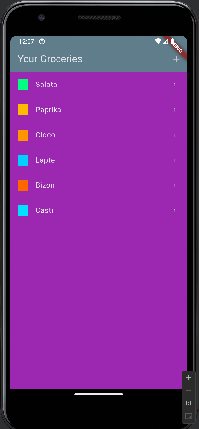
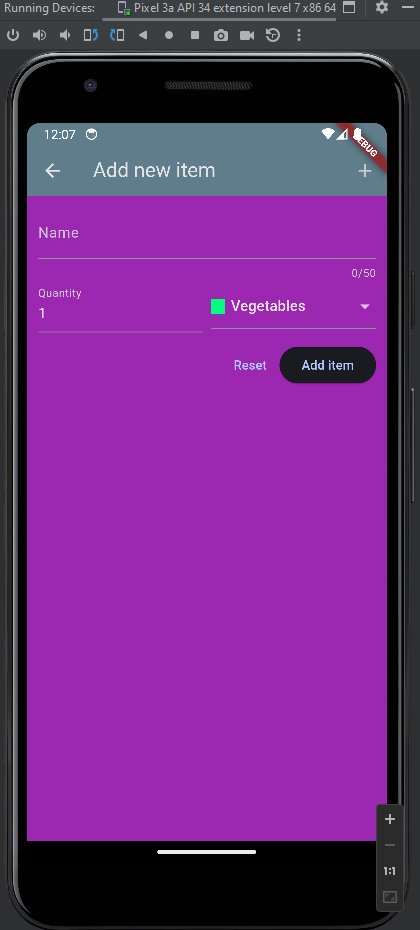
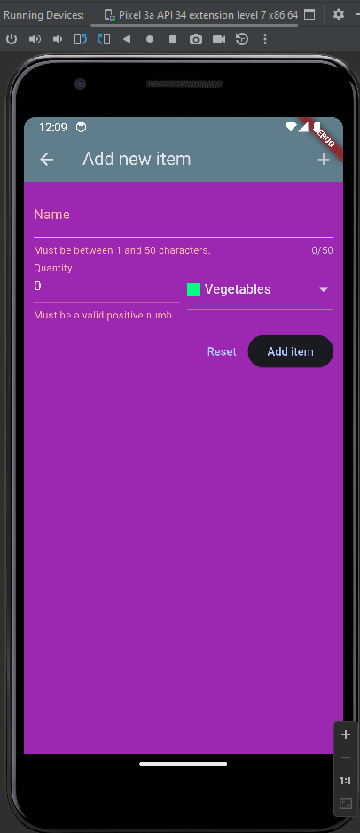

# Grocery List

Application in which I learned about:
- Using Google Firebase to create a backend
- Using Forms to validate/save data
- HTTP Requests in Flutter 
- Handling errors 
- Future Builder

## Final Result

